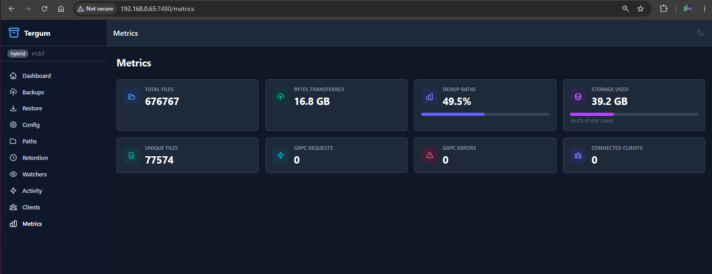
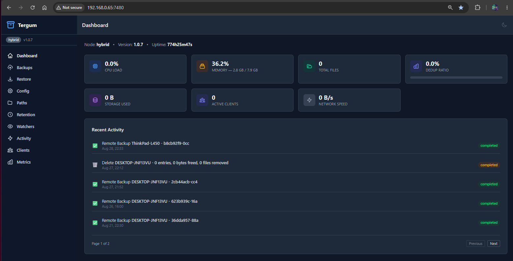
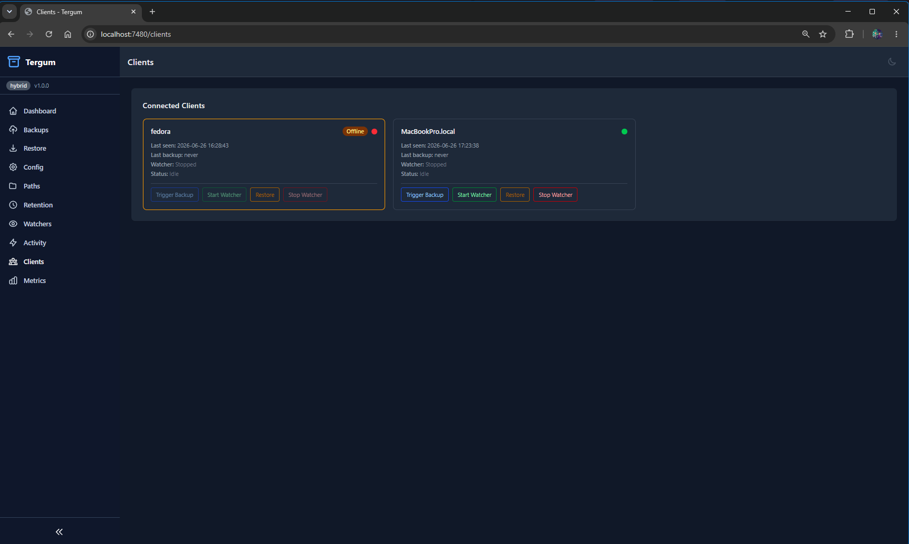

# Tergum

Encrypted, deduplicated backup system with gRPC streaming, mutual TLS, policy-based retention, and real-time file watching.

A single statically-linked binary acts as client, server, or both.

> **Note:** While Tergum ships a hybrid web interface for both server and client, its primary focus is a command-line experience built around ease of use and simplicity. The web UI complements the CLI rather than replacing it.

> 📖 **Start here:** [**CLI Reference (docs/CLI.md)**](docs/CLI.md) — the complete command guide and the best way to get the most out of Tergum. Since Tergum is CLI-first, this is essential reading.

## Key Features

- **Encryption**: AES-256-GCM with per-file DEK, Argon2id master key derivation
- **Deduplication**: BLAKE3 content-addressable storage, manifest-based diff
- **Transport**: gRPC streaming with mutual TLS (Ed25519 certificates)
- **Retention**: Policy-based expiration with safety guarantees (latest version always protected)
- **File Watching**: fsnotify with debouncing and stability gate
- **Scheduling**: Cron-based full/auto backups
- **Observability**: Prometheus metrics, structured logging, health endpoint
- **Web UI**: Embedded HTMX/Alpine.js dashboard with SSE activity log
- **Cross-platform**: Linux, macOS, Windows with platform-specific metadata

## Quick Start

```bash
# 1. Run the setup wizard
tergum setup

# 2. Start the server
TERGUM_PASSPHRASE=mypassphrase tergum server

# 3. Trigger a backup
TERGUM_PASSPHRASE=mypassphrase tergum backup

# 4. Check status
tergum status
```

For full command reference, see [MANUAL.md](docs/MANUAL.md).

## Screenshots

### Deduplication Ratio (Metrics)



### Dashboard — Manage & Remove Backups



### Clients — Online & Offline Status



## Building

Requires Go 1.24+. No CGO dependencies (pure Go SQLite via modernc.org/sqlite).

```bash
# Standard build
go build -o tergum ./

# Production build with version info
CGO_ENABLED=0 go build -ldflags="-s -w \
  -X 'github.com/gcclinux/tergum/cmd.Version=$(git describe --tags --always)' \
  -X 'github.com/gcclinux/tergum/cmd.Commit=$(git rev-parse --short HEAD)' \
  -X 'github.com/gcclinux/tergum/cmd.BuildDate=$(date -u +%Y-%m-%dT%H:%M:%SZ)'" \
  -o tergum ./

# Using Makefile
make build

# Run tests
make test
```

Cross-compile for any platform Go supports:

```bash
GOOS=linux GOARCH=amd64 CGO_ENABLED=0 go build -o tergum-linux ./
GOOS=darwin GOARCH=arm64 CGO_ENABLED=0 go build -o tergum-macos ./
GOOS=windows GOARCH=amd64 CGO_ENABLED=0 go build -o tergum.exe ./
```

### Build Scripts

Platform-specific build scripts are provided that handle cross-compilation and version embedding automatically.

| Script | Platform | Usage |
|--------|----------|-------|
| `build.sh` | Linux/macOS | `./build.sh [--prod] [target]` |
| `build.bat` | Windows (cmd) | `build.bat [--prod] [target]` |
| `build.ps1` | Windows (PowerShell) | `.\build.ps1 [-Prod] [target]` |

**Targets:** `linux`, `darwin` (or `macos`), `windows` (or `win`), `all` (default)

All scripts output binaries to the `dist/` directory and embed version, commit hash, and build timestamp via ldflags.

> **macOS users (compiled binary):** macOS Gatekeeper quarantines downloaded binaries, which prevents `tergum service enable` from launching the service via launchd. From the directory where the binary lives, clear the quarantine flag first:
>
> ```bash
> xattr -d com.apple.quarantine tergum-arm64-macos
> ```

## Architecture

```
┌─────────────────────────────────────────────────────┐
│                    Client                            │
│  Scanner → Manifest → Dedup → Encrypt → Stream      │
│  Watcher → Debounce → Stability → Ongoing Backup    │
└──────────────┬──────────────────────────────────────┘
               │ gRPC + mTLS (Ed25519)
               │ Port 7400 (commands) / 7401 (data)
┌──────────────▼──────────────────────────────────────┐
│                    Server                            │
│  CAS Storage (/hash[:2]/hash)                       │
│  SQLite DB (WAL mode)                               │
│  Retention Engine (hourly)                          │
│  Scheduler (cron)                                   │
│  Web UI (:7480) / Metrics (:7490)                   │
└─────────────────────────────────────────────────────┘
```

## How Deduplication Works

Tergum uses BLAKE3 content-addressable storage to avoid storing duplicate data:

1. **Scan** — the client walks all include paths and collects file metadata
2. **Hash** — each file's content is hashed with BLAKE3 (a fast cryptographic hash producing a 256-bit fingerprint)
3. **Manifest** — the client builds a manifest: a list of `(file_path, blake3_hash)` pairs
4. **Exchange** — the manifest is sent to the server, which replies with which hashes it already has
5. **Upload only new content** — files whose hash already exists on the server are skipped entirely. Only genuinely new content is encrypted and uploaded
6. **Storage** — files are stored by hash in a content-addressable store (`storage/<first 2 chars of hash>/<full hash>`). Multiple files with identical content share a single stored blob

**What this means in practice:**

- If you have the same file in 5 different folders, it's stored once
- If a 1GB file hasn't changed between backups, it's never re-uploaded
- Renaming or moving a file doesn't cause re-upload (same content = same hash)
- Deleting a backup entry only removes the physical file when no other entry references it (refcount tracking)

**Example:** A 10GB project backed up daily for 30 days where only 200MB changes per day uses ~16GB of storage instead of 300GB — the unchanged files are deduplicated across all 30 backup sets.

## Default Exclude Patterns

The setup wizard offers a default set of exclude patterns that skip build artifacts, caches, and version control directories:

| Pattern | What it skips |
|---------|---------------|
| `*.tmp` | Temporary files |
| `*.log` | Log files |
| `*.o` | C/C++ object files |
| `*.class` | Java compiled classes |
| `.git/` | Git repositories |
| `.cache/` | General caches |
| `.nuget/` | .NET package cache |
| `.npm/` | NPM cache |
| `.gradle/` | Gradle cache |
| `node_modules/` | Node.js dependencies |
| `__pycache__/` | Python bytecode cache |
| `bin/Debug/` | .NET debug builds |
| `bin/Release/` | .NET release builds |
| `obj/` | .NET intermediate output |
| `target/` | Rust/Java/Maven build output |
| `dist/` | Build distribution folders |

## Network Ports

| Port | Service |
|------|---------|
| 7400 | gRPC CommandService |
| 7401 | gRPC DataService |
| 7480 | Web management UI |
| 7490 | Prometheus metrics + `/health` endpoint |

## Documentation

- [MANUAL.md](docs/MANUAL.md) — Full command reference, configuration, and usage guide

## License

See LICENSE file.
